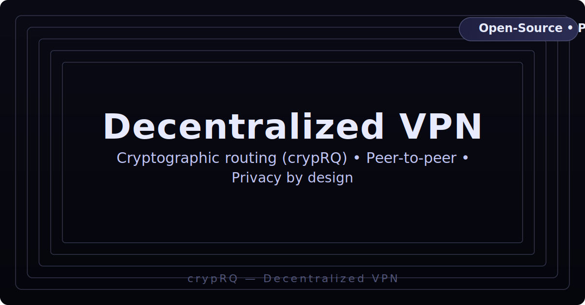

[](https://buy.stripe.com/00w6oA7kM4wc4co5RB3Nm01)
[](https://buy.stripe.com/7sY3cobB2bYEdMYa7R3Nm00)

# CrypRQ: Post-Quantum, Zero-Trust VPN  
[](docs/_assets/logo.svg)

[](https://github.com/codethor0/cryprq/actions/workflows/ci.yml)
[](https://github.com/codethor0/cryprq/actions/workflows/security-audit.yml)
[](https://github.com/codethor0/cryprq/actions/workflows/codeql.yml)
[](LICENSE)
[](REPRODUCIBLE.md)
[](https://buy.stripe.com/00w6oA7kM4wc4co5RB3Nm01)
[](https://buy.stripe.com/7sY3cobB2bYEdMYa7R3Nm00)


> Post-quantum, zero-trust VPN with five-minute ephemeral key rotation.

## Table of Contents
1. [Features](#features)
2. [Anti-features](#anti-features)
3. [Quickstart](#quickstart)
4. [Deploy](#deploy)
5. [Configuration](#configuration)
6. [Security Model](#security-model)
7. [Reproducible Builds](#reproducible-builds)
8. [Roadmap](#roadmap)
9. [Contributing](#contributing)
10. [License](#license)

---

## Features
- Hybrid ML-KEM (Kyber768-compatible) + X25519 handshake over libp2p QUIC.
- Five-minute key rotation with secure zeroization of prior keys.
- Userspace WireGuard prototype using ChaCha20-Poly1305 and BLAKE3 KDF.
- Dedicated crates: `crypto` (`no_std` ML-KEM), `p2p` (libp2p swarm), `node` (tunnel), `cli`.
- Supply-chain hardening: vendored dependencies, `cargo audit`, `cargo deny`, `CodeQL`.
- Release pipeline emits SPDX SBOMs (Syft) and Grype vulnerability reports for container images.
- Reproducible build scripts for Linux (musl), macOS, Nix, and Docker.
- Platform hosts underway: Android `VpnService` module (`android/`), Apple Network Extension, Windows MSIX, F-Droid packaging. See `/docs` for plans and status.

## Anti-features
- No production data-plane yet; packet forwarding is incomplete.
- No automatic peer discovery or centralized management plane.
- No legacy cipher or insecure transport support.
- No claims of FIPS/CC compliance; crypto remains experimental.
- No DoS protections beyond basic libp2p limits.

## Quickstart
```bash
rustup toolchain install 1.83.0
git clone https://github.com/codethor0/cryprq.git
cd cryprq
cargo build --release -p cryprq
```

Start a listener:
```bash
./target/release/cryprq --listen /ip4/0.0.0.0/udp/9999/quic-v1
```

Dial from another shell or host:
```bash
./target/release/cryprq --peer /ip4/127.0.0.1/udp/9999/quic-v1
```

Expect logs such as `Local peer id: ...` on the listener and `Connected to ...` on the dialer.

## Deploy
### Bare Metal
- Linux or macOS with Rust 1.83.0.
- Open TCP/UDP 9999 inbound on firewalls.
- Minimal systemd unit:
```ini
[Unit]
Description=CrypRQ Listener
After=network-online.target
Wants=network-online.target

[Service]
User=cryprq
Group=cryprq
Environment=RUST_LOG=info
ExecStart=/usr/local/bin/cryprq --listen /ip4/0.0.0.0/udp/9999/quic-v1
Restart=on-failure

[Install]
WantedBy=multi-user.target
```

### Docker
```bash
docker build -t cryprq-node .
docker run --rm -p 9999:9999/udp cryprq-node \
  --listen /ip4/0.0.0.0/udp/9999/quic-v1
```

Compose snippet:
```yaml
services:
  listener:
    image: cryprq-node:latest
    build: .
    command: ["--listen", "/ip4/0.0.0.0/udp/9999/quic-v1"]
    ports:
      - "9999:9999/udp"
    restart: unless-stopped
```

### Nix
```bash
nix build
./result/bin/cryprq --listen /ip4/0.0.0.0/udp/9999/quic-v1
```

### Cloud Notes
- Allow TCP/UDP 9999 from trusted peers.
- Store logs on encrypted volumes; disable unused services.
- Ensure VM time synchronization for consistent rotation.

## Configuration
| Option | Description | Default |
|--------|-------------|---------|
| `--listen <multiaddr>` | Listener mode multiaddr. | None |
| `--peer <multiaddr>` | Dialer mode multiaddr (optionally `/p2p/<peer-id>`). | None |
| `--allow-peer <peer-id>` | Allowlist specific peer IDs (repeatable). | Allow all |
| `--metrics-addr <addr>` | Bind Prometheus metrics/health server. | `127.0.0.1:9464` |
| `RUST_LOG` | Log level (`error`…`trace`). | `info` |
| `CRYPRQ_ROTATE_SECS` | Rotation interval in seconds. | `300` |
| `CRYPRQ_MAX_INBOUND` | Max pending/established inbound handshakes. | `64` |
| `CRYPRQ_BACKOFF_BASE_MS` | Initial inbound backoff (ms) after failures. | `500` |
| `CRYPRQ_BACKOFF_MAX_MS` | Max inbound backoff (ms). | `30000` |

Peer flow: listener logs a peer ID, dialer connects using the multiaddr, libp2p ping events confirm liveness.

## Security Model
- Assets: hybrid handshake secrets, tunnel keys (future), logs.
- Trust boundaries: no implicit trust; all peers authenticate via libp2p identity keys.
- Post-quantum intent: ML-KEM counters store-now-decrypt-later for key exchange.
- Rotation rationale: five-minute cadence constrains exposure window.
- Limitations:
  - Data-plane encryption still in development.
  - mDNS discovery disabled in hardened deployments.
  - No automated peer revocation or ACL enforcement yet.
  - Dependency `pqcrypto-mlkem` under active review.
- Responsible disclosure: codethor@gmail.com (PGP in SECURITY.md).
- Supply-chain checks: `cargo audit`, `cargo deny`, `CodeQL`, `scripts/docker_vpn_test.sh`.

## Reproducible Builds
- Linux: `./scripts/build-linux.sh` (musl).
- macOS: `./scripts/build-macos.sh`.
- Docker: `docker build -t cryprq-node .`.
- `./finish_qa_and_package.sh` bundles QA logs, binaries, checksums, an SPDX SBOM, and a Grype report under `release-*/security/`.
- See [REPRODUCIBLE.md](REPRODUCIBLE.md) for deterministic build steps and expectations.

## FFI & Platform Hosts
- The new `cryp-rq-core` crate exposes a C ABI: `cryprq_init`, `cryprq_connect`, `cryprq_read_packet`, `cryprq_write_packet`, `cryprq_on_network_change`, and `cryprq_close`.
- Header generation: `cbindgen --config cbindgen.toml --crate cryprq_core --output cryprq_core.h`.
- Cross-target CI validates `cargo check` for Apple (macOS/iOS), Android, and Windows static library builds.
- Documentation: [docs/ffi.md](docs/ffi.md) covers error codes, ownership rules, and deterministic build guidance.

## Roadmap
- Complete userspace WireGuard forwarding.
- Add peer directory + policy enforcement.
- Expose metrics/health endpoints.
- Explore PQ data-plane ciphers.
- Publish crates with versioned releases.

## Contributing
1. `cargo fmt --all`
2. `cargo clippy --all-targets --all-features -- -D warnings`
3. `cargo test --release`
4. `cargo audit --deny warnings` & `cargo deny check ...`
5. `./scripts/docker_vpn_test.sh`
6. See [CONTRIBUTING.md](CONTRIBUTING.md) for full workflow and doc updates.

## License
CrypRQ is licensed under the [MIT License](LICENSE). Apache 2.0 text is kept for reference; MIT is authoritative.

## Support

If this project helps you, consider supporting ongoing maintenance:

- ❤️ **One-time tip:** https://buy.stripe.com/00w6oA7kM4wc4co5RB3Nm01  
- ♻️ **Monthly support:** https://buy.stripe.com/7sY3cobB2bYEdMYa7R3Nm00

**What you fund:** maintenance, docs, roadmap experiments, and new features.

Thank you! 🙌🏿
